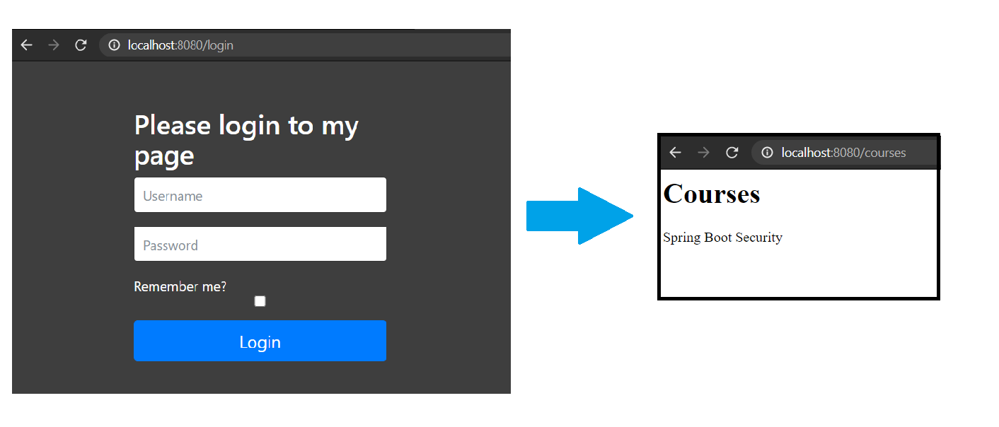

#Spring Security

##Description
My personal learning project of Spring Security

#Form Based Authentication
  
Session ID is stored in in-memory daabase by Spring  
It can also be sotred in Postgres, Redis, etc.  
Everytime the Application is reset, the Session ID will be lost and reset with new value, in case of in-momry db.  
Best practice is to implement real database server.  

#Custom Login Page 
  
Custom Login Page is implemented by using thymeleaf.  
TemplateController.java, along with login.html and courses.html is implemented.  
Redirect to /courses page and remember me is implemented in configure method of ApplicationSecurityConfig.java.  

