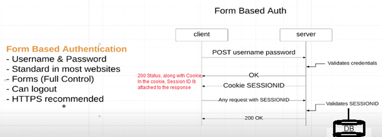
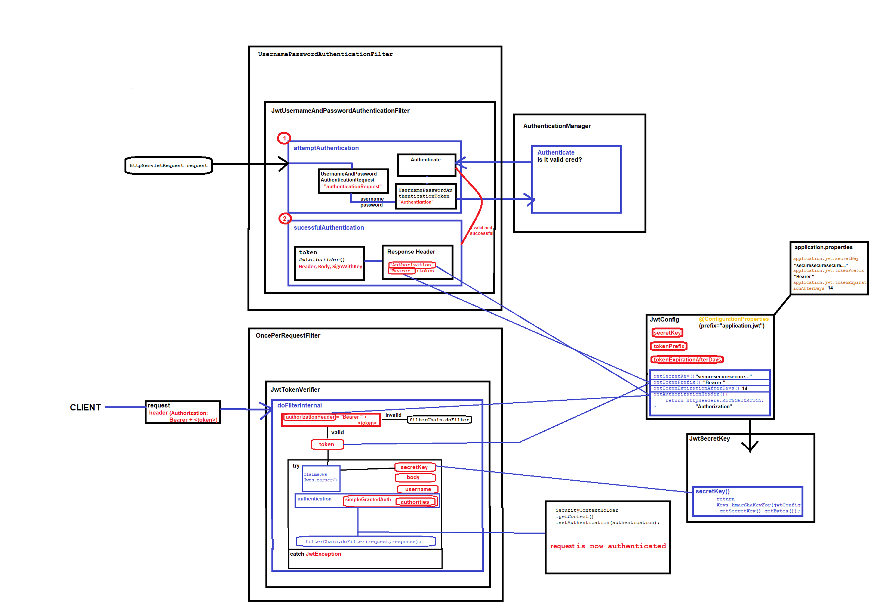

#Spring Security

##Description
My personal learning project of Spring Security

#Form Based Authentication
  
Session ID is stored in in-memory database by Spring  
It can also be stored in Postgres, Redis, etc.  
Everytime the Application is reset, the Session ID will be lost and reset with new value, in case of in-memory db.  
Best practice is to implement real database server.  

#Custom Login Page 
  
Custom Login Page is implemented by using thymeleaf.  
TemplateController.java, along with login.html and courses.html are implemented.  
Redirect to '/courses' page and remember-me are implemented in configure method of ApplicationSecurityConfig.java.  

#Logout  
If CSRF protection is enabled (default), then the request mest be also be a POST.  
This means that by default POST "/logout" is required to trigger a logout.  
If CSRF protection is disabled, then any http method is allowed.  
It is considered best pracrice to use an HTTP POST on any action that changes state to protect against CSRF attacks.  
To use HTTP GET, use logoutRequestMatcher(new AntPathRequestMatcher(logoutUrl, "GET"));  
ApplicationSecurityConfig.java - configure method  
  
Logout button is added on the courses.html (localhost:8080/courses)  
  

#Database Authentication  
  
The ApplicationUserDao interface makes it very easy to switch data source.  
Currently, FakeApplicationUserDaoService (which has a"fake" implementation name) has in-memory datasource for linda, tom, annasmith (users).  
To switch data source, simply create another service class implementing the same ApplicationUserDao interface, give it a different @Repository name and tag it in @Qualifier of ApplicationUserService class, based on whatever implementation you want.  

#JWT Authentication
    
In JWT Auth process,   
1. Front end client first sends some credentials (username/password) to authenticate itself.  
2. The backend server checks those credentials, and if they are valid, it generates a JWT and returns it.  
3. client has to provide this token in the request’s Authorization header in the “Bearer TOKEN” form.  
4. The back end will check the validity of this token and authorize or reject requests. 
    The token may also store user roles and authorize the requests based on the given authorities.  

